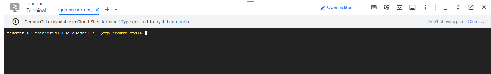
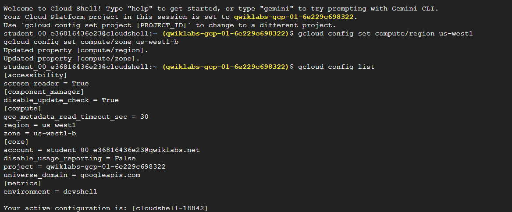
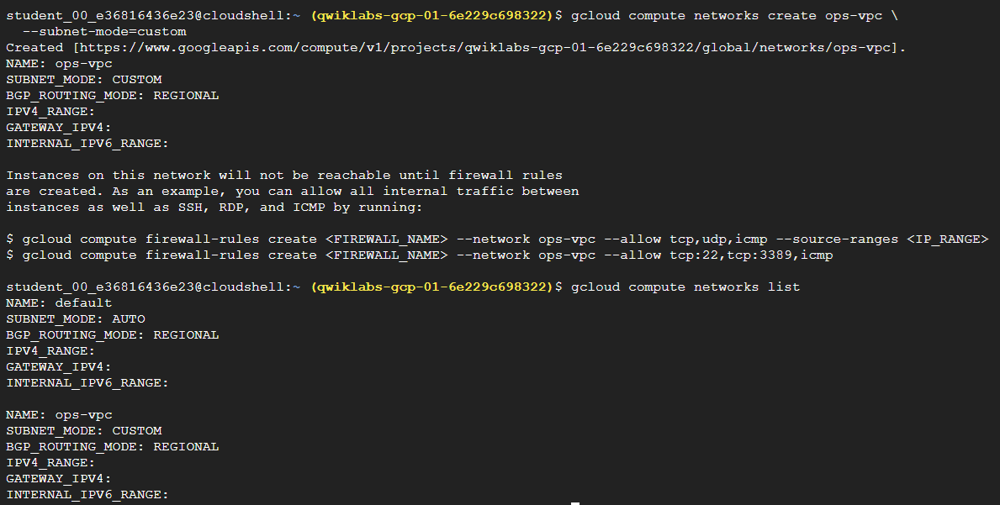
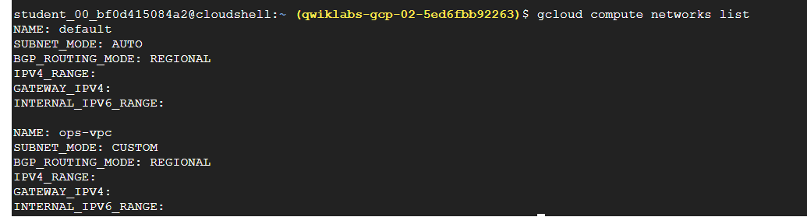
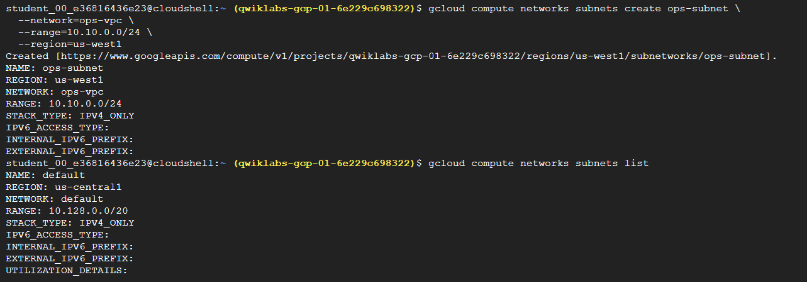
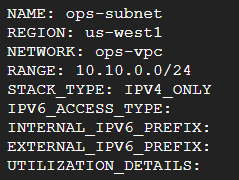
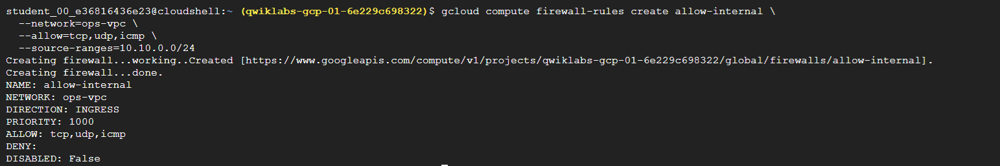
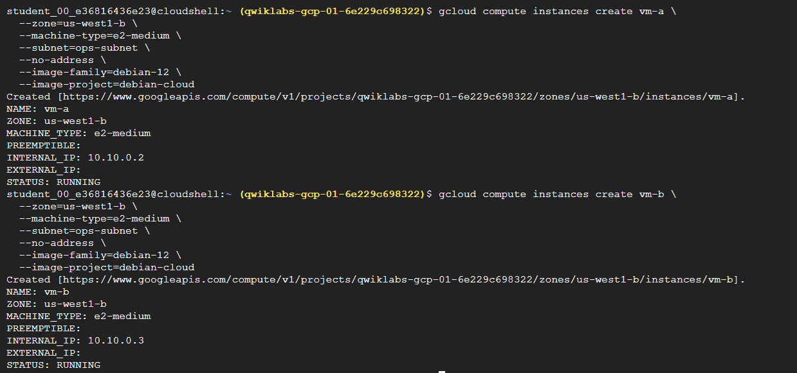
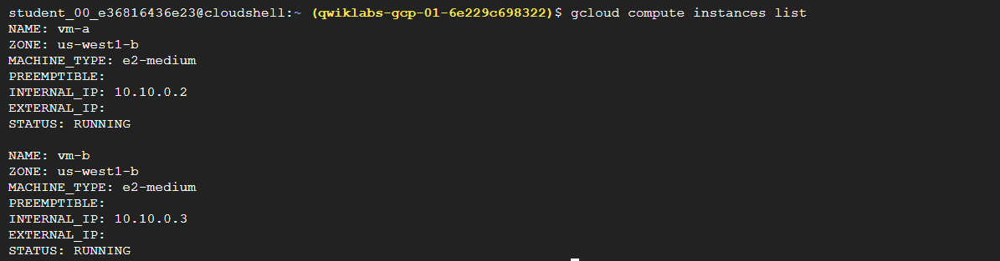
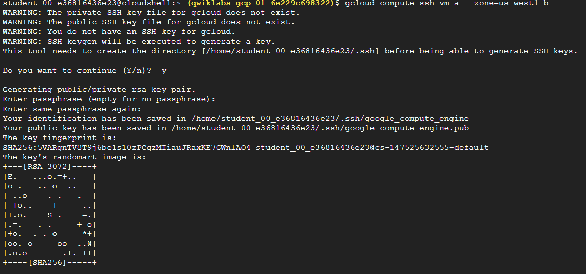

# GCP Core VPC Networking Project

## Overview
This project demonstrates the implementation of core Google Cloud networking components
using Google Cloud Shell and Compute Engine.

The project follows concepts covered in:
- Google Cloud Fundamentals
- Essential Google Cloud Infrastructure – Foundation

All resources were created using the `gcloud` CLI.

---

## Project Scope
The project includes:
- Custom VPC network
- Custom subnet configuration
- Firewall rules for internal traffic
- Compute Engine VM instances
- SSH connectivity using Cloud Shell

The project intentionally excludes advanced services such as IAM, Cloud Storage,
Monitoring, and Load Balancing to stay aligned with foundational course content.

---

## Environment Configuration
The Cloud Shell environment was used to configure the project settings.

- Region: `us-west1`
- Zone: `us-west1-b`

---

## VPC Network Creation
A custom VPC network was created instead of using the default network.

- VPC Name: `ops-vpc`
- Subnet mode: Custom

---

## Subnet Configuration
A custom subnet was created within the VPC.

- Subnet Name: `ops-subnet`
- Region: `us-west1`
- CIDR Range: `10.10.0.0/24`

---

## Firewall Rules
Firewall rules were configured to allow internal communication between VM instances.

- Rule Name: `allow-internal`
- Allowed traffic: TCP, UDP, ICMP
- Source range: `10.10.0.0/24`

---

## VM Instances Deployment
Two VM instances were created within the custom subnet.

- VM Names: `vm-a`, `vm-b`
- Zone: `us-west1-b`
- OS: Debian 12
- External IP: Disabled

---

## SSH Connectivity
SSH access to the VM instances was established securely using Google Cloud Shell.

---

## Notes
This project was implemented in a restricted lab environment (Qwiklabs),
which limited access to certain Google Cloud services.
